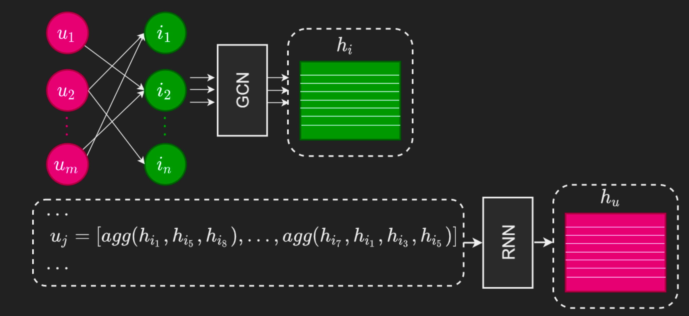

# Naive recommendation system, based on graph neural networks
Model uses simple approach to handle user-item graph dynamics:  
embed each graph snapshot with standard static GNNs, aggregate embeddings over time with RNN.

    

1. Compute items embeddings by Graph Attention Network
2. Aggregate each user purchases on each week - get weeks embeddings
3. Aggregate sequence of weeks embeddings with Gated Recurrent Unit
4. Apply Attention aggregator to GRU output - this is users embeddings
5. Use dot product of user and item embedding to calculate link prediction score